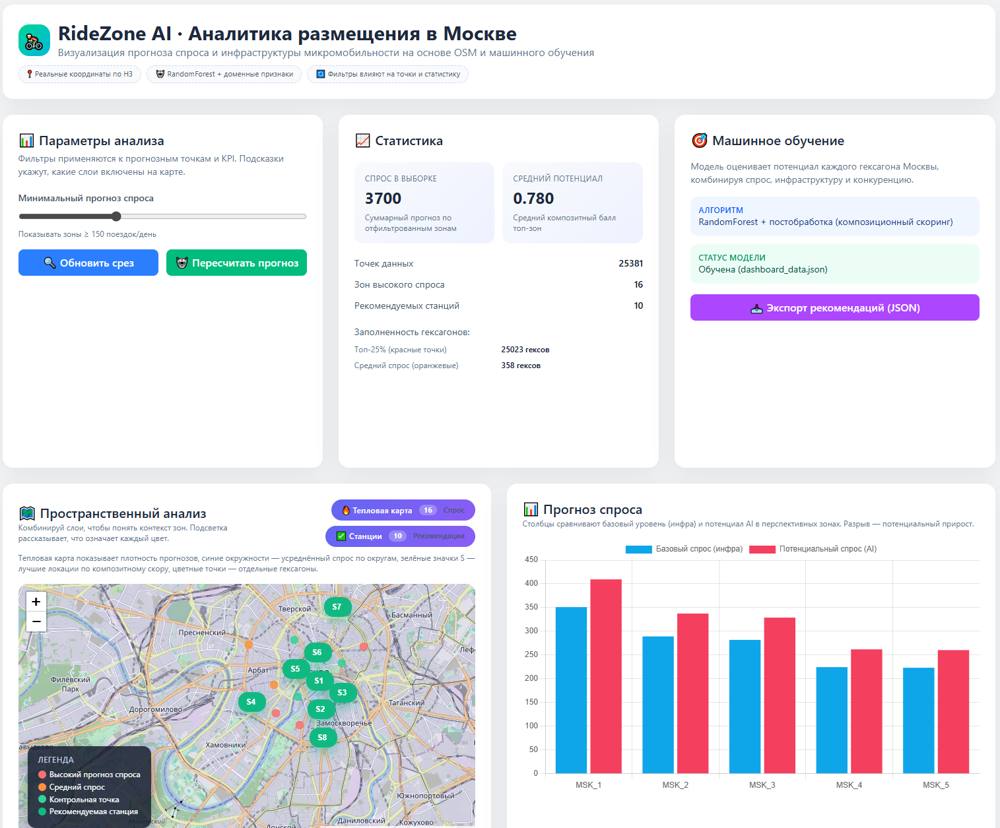
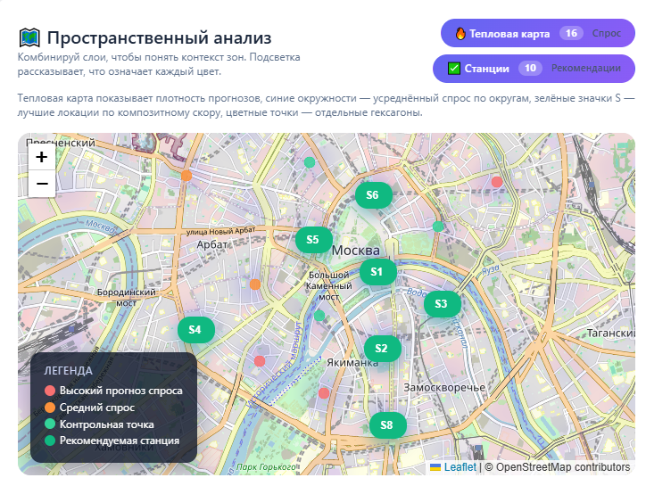
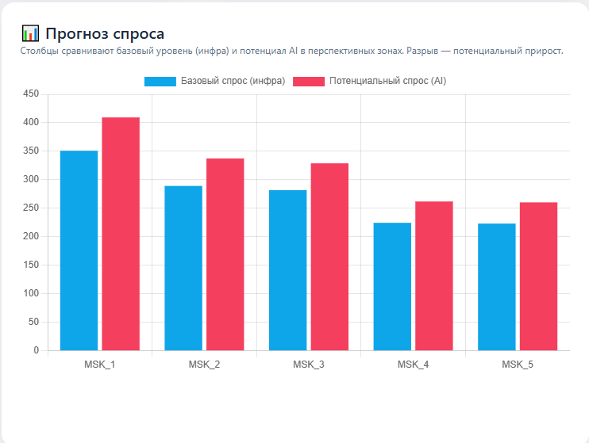
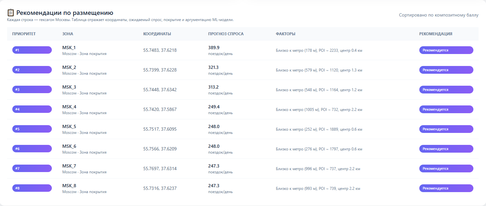

# RideZone AI · Прогноз спроса на микромобильность 🚴‍♂️



**RideZone AI** - интеллектуальная система поддержки принятия решений для прогнозирования оптимальных зон размещения станций проката велосипедов и самокатов в мегаполисах.

Проект реализует методику адаптации модели с переносом знаний между доменами (Transfer Learning): модель обучается на открытых данных реальных поездок системы Divvy Bikes (Чикаго), извлекает фундаментальные урбанистические закономерности (влияние транспортных узлов, плотности точек интереса, типа застройки) и переносит эти паттерны на территорию Москвы, для которой исторические логи поездок отсутствуют в публичном доступе.

 *Скриншот интерактивного дашборда (см. папку `docs/`)*

***

## 🚀 Ключевые особенности

-   **🧠 Адаптация модели между доменами**: Обучение на исходном домене (Чикаго) с реальными поездками → применение к целевому домену (Москва) с инфраструктурными данными.
-   **🌍 Гексагональная сетка H3**: Использование иерархического индекса Uber H3 (разрешение 8) для унификации пространственных данных и агрегации признаков.
-   **🏗️ Автоматизированное формирование признаков**: Извлечение инфраструктурных характеристик через картографическую систему OpenStreetMap: расстояния до станций метрополитена, плотность офисов, кафе, парковых зон.
-   **📊 Интерактивный аналитический дашборд**: Тепловые карты прогнозируемого спроса, кластеризация районов и ранжированная таблица рекомендаций с интерпретацией факторов.

## 🛠 Архитектура решения

Система построена по модульному принципу:

1. Модуль загрузки данных (ChicagoDivvyLoader): Обрабатывает сырые CSV-файлы системы Divvy 2023, выполняет очистку GPS-шума и агрегирует поездки по H3-гексагонам.
2. Модуль инженерии признаков (OSMFeatureEngineer): Извлекает инфраструктурные характеристики для каждого гексагона через библиотеку OSMnx. Поддерживает кэширование и режим симуляции для работы без запросов к API.
3. Модуль обучения (TransferRegressor): Регрессионная модель на основе алгоритма случайного леса (Random Forest), обучаемая на логарифмированной целевой переменной спроса.
4. Модуль инференса (InferenceEngine): Генерирует гексагональную сетку для Москвы, собирает идентичные признаки и строит прогноз на основе обученной модели.
5. Модуль визуализации (DashboardBuilder): Преобразует результаты прогнозирования в оптимизированный JSON для веб-интерфейса.

## 📦 Быстрый старт

### Установка
```bash
git clone https://github.com/<your-login>/RideZone.git
cd RideZone

# Создание виртуального окружения
python -m venv venv
source venv/bin/activate  # Linux/Mac
# venv\Scripts\activate   # Windows

# Установка зависимостей
pip install -e .[dev]
```

### Запуск пайплайна (CLI)
Единая точка входа для обработки данных и обучения:

```bash
# Полный цикл: Обработка Чикаго -> Обучение -> Прогноз по Москве
ridezone-ai \
  --chicago-dir data/raw_chicago \
  --output results/moscow_predictions.csv \
  --resolution 8 \
  --simulate-osm  # Используйте этот флаг для быстрого теста без запросов к API OSM
```

После завершения в папке `results/` появятся:
- `moscow_predictions.csv` — прогноз спроса.
- `transfer_model.pkl` — сохраненная модель.
- `metrics.json` — отчет о качестве обучения (R², MAE на данных Чикаго).

### Запуск дашборда
```bash
# 1. Генерация данных для веб-интерфейса
python scripts/build_dashboard_data.py --input results/moscow_predictions.csv --output web/dashboard_data.json

# 2. Запуск локального сервера
cd web
python -m http.server 8000
```
Откройте [http://localhost:8000](http://localhost:8000) в браузере.

## 🧪 Тестирование

Проект покрыт unit-тестами. Для запуска используйте `pytest`:
```bash
pytest tests/
```
*Тесты проверяют корректность генерации H3-индексов и формат входных/выходных данных моделей.*

## 📂 Структура репозитория

```text
RideZone/
├── ridezone_ai/           # Основной пакет
│   ├── core/              # Логика H3 и конфиги
│   ├── data/              # Загрузчики (Divvy, OSM)
│   ├── models/            # Обучение и инференс (sklearn)
│   └── cli.py             # Точка входа
├── scripts/               # Вспомогательные скрипты
├── tests/                 # Тесты
├── web/                   # HTML/JS дашборд
│   ├── index.html
│   └── assets/
├── data/                  # Локальные данные (в .gitignore)
└── pyproject.toml         # Зависимости
```

## 💡 Примеры функционала

#### Интерактивная карта зон размещения


На интерактивной карте визуализируются рекомендованные зоны для размещения станций микромобильности:
* Зеленые маркеры S1-S8 - приоритетные локации по композитному скору модели (учитывается инфраструктура, прогнозируемый спрос, конкурентная среда).
* Цветные точки - отдельные H3-гексагоны с градиентной окраской по уровню прогнозируемого спроса (зеленый - низкий, оранжевый - средний, красный - высокий).
* Легенда - поясняет семантику цветов и символов, позволяя быстро идентифицировать перспективные зоны и территории, требующие развития инфраструктуры.

Интерфейс поддерживает динамическую фильтрацию по радиусу визуализации и минимальному порогу спроса.

#### График сравнительного прогноза


Столбчатая диаграмма демонстрирует сравнение двух сценариев для восьми наиболее перспективных зон:

* Синий столбец ("Базовый спрос, инфра") - оценка текущего потенциала территории на основе инфраструктурных характеристик (близость к метро, плотность POI).
* Красный столбец ("Потенциальный спрос, AI") - прогноз модели с учетом оптимальных условий, выявленных на данных обучающего города (Чикаго).
* Разрыв между столбцами - визуализирует предполагаемый прирост спроса после реализации рекомендаций по размещению станций.

Подписи по оси X соотносятся с маркерами S1-S8 на карте для обеспечения согласованности визуализации.

#### Таблица рекомендаций по размещению


Каждая строка таблицы описывает конкретный гексагон: координаты, прогноз спроса и факторы (спрос, инфраструктура, конкуренция, рост).


## ⚖️ Лицензия и данные

-   Исходный код распространяется под лицензией **MIT**.
-   Данные **Divvy Bikes** используются в соответствии с [Divvy Data License Agreement](https://divvybikes.com/data-license-agreement).
-   Геоданные **OpenStreetMap** © OpenStreetMap contributors.
