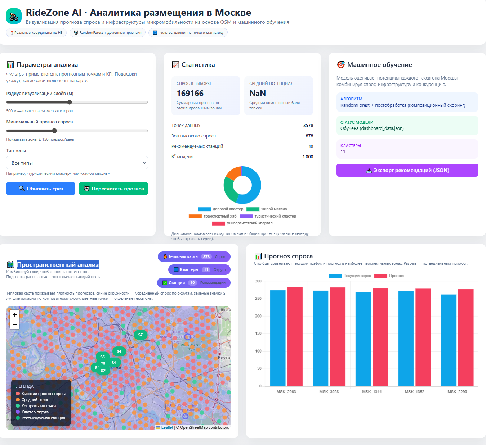
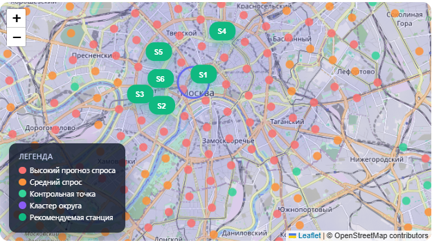
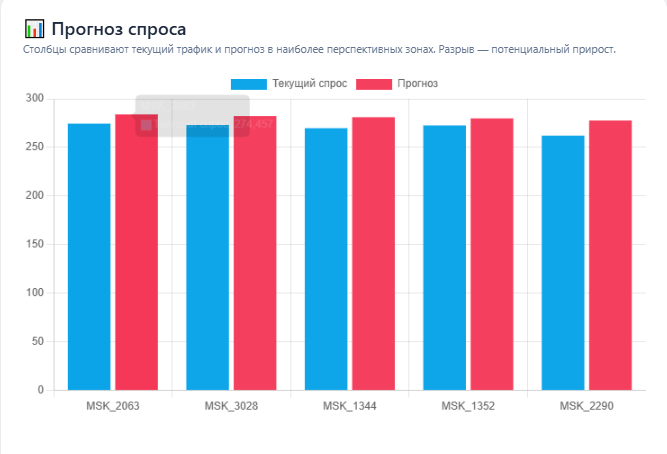
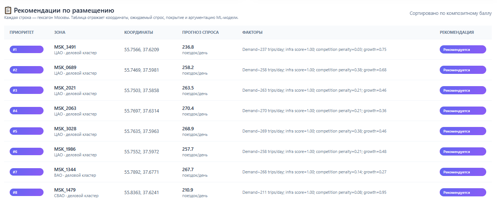

# Прогнозирование оптимальных зон для размещения станций проката микротранспорта

RideZone AI — это аналитическая платформа, которая собирает данные из OpenStreetMap и обогащает их геопризнаками, чтобы рекомендовать места для станций микромобильности в Москве.



## 📜 Оглавление

- [🎯 О проекте](#-о-проекте)
- [🛠️ Используемые технологии](#-используемые-технологии)
- [⚙️ Установка и запуск](#-установка-и-запуск)
- [💾 Данные](#-данные)
- [🤖 Модели](#-модели)
- [📊 Результаты](#-результаты)
- [🗂️ Структура проекта](#-структура-проекта)
- [🖼️ Примеры функционала](#-примеры-функционала)
- [📎 Приложение Б. Результаты экспериментов](#-приложение-б-результаты-экспериментов)

## 🎯 О проекте

Платформа помогает городским операторам принимать решения о том, куда ставить новые станции проката. Мы совмещаем пространственные характеристики, инфраструктуру и поведенческие паттерны, а затем обучаем модели для прогноза спроса и ранжирования локаций.

**Проблема:** стихийное размещение станций приводит к простоям в деловых кварталах и дефициту транспорта во дворах и у транспортных узлов.

**Цель:** построить ML-процесс, который автоматически выявляет перспективные зоны, показывает метрики уверенности и готовит данные для бизнес-дешборда.

**Задачи:**
- Сбор геоданных и признаков по инфраструктуре и населению.
- Формирование H3‑решётки и агрегация событий в клетках.
- Обучение и оценка моделей спроса/приоритета.
- Визуализация рекомендаций в веб‑дешборде и подготовка отчётных артефактов.

## 🛠️ Используемые технологии

- Python 3.12
- pandas, numpy
- scikit-learn (RandomForestRegressor/Classifier, Pipeline)
- geopandas, shapely, osmnx, h3
- matplotlib, seaborn, Chart.js, Leaflet
- Jupyter Notebook, CLI на click

## ⚙️ Установка и запуск

1. **Клонировать репозиторий**
   ```bash
   git clone https://github.com/<your-login>/RideZone_AI.git
   cd RideZone_AI
   ```
2. **Создать виртуальное окружение**
   ```bash
   python -m venv venv
   venv\Scripts\activate    # Windows
   # source venv/bin/activate # macOS/Linux
   ```
3. **Установить зависимости**
   ```bash
   pip install -e .[dev]
   ```
4. **Собрать датасет и признаки**
   ```bash
   python scripts/build_moscow_dataset.py --resolution 8
   python scripts/build_dashboard_data.py --output web/dashboard_data.json
   ```
5. **Запустить пайплайн/CLI**
   ```bash
   ridezone-ai --top-k 8
   ```
6. **Открыть HTML-дэшборд**
   ```bash
   cd web
   python -m http.server 8000
   # http://localhost:8000/dashboard.html
   ```
7. **Сгенерировать артефакты для защиты (Appendix B)**
   ```bash
   python scripts/run_experiments.py
   # или python scripts/run_experiments.py --input data/processed/features.parquet --target demand
   ```

## 💾 Данные

**Источник:** OpenStreetMap через `osmnx` + внутренние CSV/Parquet после пайплайна `scripts/build_moscow_dataset.py`.

**Описание:**
- Геометрия города → гексагональная сетка H3 (resolution 8).
- Для каждой ячейки собираются признаки по POI (транспорт, торговля, образование, жильё, офисы, досуг), плотность населения, конкуренты, доступ к общественному транспорту.
- Целевая переменная — прогнозируемый спрос/выручка станции (агрегация поездок и эвентов).

**Предобработка:**
- Очистка мультиполигонов и фильтрация пустых геометрий.
- Нормализация числовых признаков, one-hot для категорий, заполнение пропусков в пайплайне sklearn.
- Инженерия интегрального потенциала (attractiveness + competition) и KPI для отчётности.

## 🤖 Модели

**Выбор моделей:**
- `RandomForestRegressor` — основная модель прогноза спроса.
- `GradientBoostingRegressor` и `LinearRegression` — бенчмарки в экспериментах.
- Для классификационных задач (например, high/low demand) доступны Logistic Regression и RandomForestClassifier.

**Обучение и оценка:**
- sklearn Pipeline (импутация → масштабирование → модель).
- Метрики: MAE, RMSE, R² для регрессии; Accuracy, F1_macro, ROC-AUC (бинарный случай) для классификации.
- `scripts/run_experiments.py` выполняет 5-fold CV, строит learning/loss curves и запускает статистические тесты (Wilcoxon, Levene, анализ остатков).

## 📊 Результаты

- **Ключевой вывод 1:** высокий спрос фиксируется вдоль радиальных линий метро и в деловом центре; трафик падает за пределами третьего транспортного кольца.
- **Ключевой вывод 2:** оптимальное число кластеров для текущего набора признаков — 5; они покрывают ЦАО, южные спальные районы, северные бизнес-парки, транспортные хабы на востоке и туристические зоны.


*Пример слоя с рекомендованными зонами, переключаемые тепловая карта / кластеры / станции.*

## 🗂️ Структура проекта

```
RideZone_AI/
├── ridezone_ai/
│   ├── cli.py                # CLI для запуска пайплайна
│   ├── config.py             # пути к данным и параметры
│   ├── data_loader.py        # загрузка/валидация датасета
│   ├── feature_engineering.py# пространственные признаки
│   ├── modeling.py           # sklearn Pipeline + RandomForest
│   ├── optimizer.py          # ранжирование рекомендаций
│   ├── osm_moscow_builder.py # выгрузка OSM по Москве
│   ├── pipeline.py           # оркестрация end-to-end
│   └── dashboard.py          # генерация JSON для веба
├── scripts/
│   ├── build_moscow_dataset.py
│   ├── build_dashboard_data.py
│   ├── generate_dataset.py
│   └── run_experiments.py    # Appendix B артефакты
├── web/
│   ├── dashboard.html
│   └── dashboard_data.json
├── docs/experiments/         # результаты экспериментов
├── tests/test_pipeline.py
├── README.md
└── pyproject.toml
```

## 💡 Примеры функционала

#### Карта зон и легенда 
На карте Leaflet отображаются исходные гексагоны, тепловая карта спроса, кластеры округов и значки рекомендуемых станций. Легенда объясняет каждый цвет, поэтому аналитик сразу видит, где спрос высокий, а где инфраструктура требует развития.

#### Прогноз спроса 
Столбчатый график сравнивает текущий трафик и прогноз модели по топ-зонам. Разрыв между синим и розовым столбцом показывает потенциальный прирост после установки станции.

#### Таблица рекомендаций 
Каждая строка таблицы описывает конкретный гексагон: координаты, прогноз спроса и факторы (спрос, инфраструктура, конкуренция, рост). Кнопка «Рекомендуется» сигнализирует менеджеру, что зона прошла все фильтры confidence.
## 📎 Приложение Б. Результаты экспериментов

- **Полные таблицы метрик всех моделей:** `docs/experiments/metrics_folds.csv`, `docs/experiments/metrics_summary.csv`, `docs/experiments/metrics_table.png`
- **Графики обучения (learning curves):** `docs/experiments/learning_curve.png`
- **Графики сходимости (loss curves):** `docs/experiments/loss_curve.png`
- **Результаты статистических тестов:** `docs/experiments/stats.json`

**Как воспроизвести:**
```bash
python scripts/run_experiments.py
```
При необходимости можно указать свой датасет: `python scripts/run_experiments.py --input data/processed/features.parquet --target demand`.


